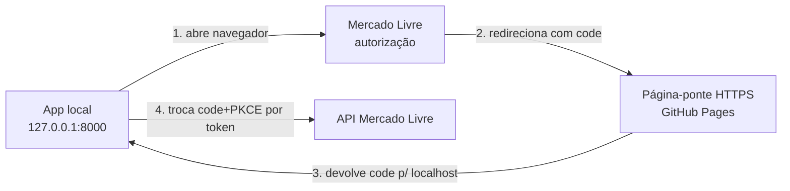

# Meu Mercado

Sistema web para **gerenciar anúncios, vendas, entregas, mensagens e reclamações do Mercado Livre** em um único lugar. A aplicação roda **localmente** em uma máquina Windows ou macOS e se conecta à conta do vendedor no Mercado Livre por meio da **API oficial** (integração OAuth 2.0).

> Status: 🚧 Em construção — este é o documento inicial do projeto. O código ainda não foi implementado.

---

## 🎯 Objetivo

Um usuário que vende no Mercado Livre autentica-se em **Meu Mercado**, que por sua vez se autentica no Mercado Livre em nome dele. A partir daí, o usuário consegue publicar e acompanhar seus anúncios sem precisar entrar no painel do Mercado Livre.

## ✨ Funcionalidades planejadas

| Funcionalidade | O que o usuário ganha | Recurso da API |
| --- | --- | --- |
| **Publicar anúncios** | Criar/editar anúncios direto pelo Meu Mercado | `POST /items`, `PUT /items/{id}` |
| **Histórico de anúncios** | Listar e consultar todos os anúncios da conta | `GET /users/{id}/items/search`, `GET /items/{id}` |
| **Estatísticas de anúncios** | Visitas, tendências e desempenho | `GET /visits/items`, `GET /trends` |
| **Vendas** | Acompanhar pedidos, valores e comissões | `GET /orders/search`, `GET /orders/{id}` |
| **Entregas** | Status de envio e rastreamento | `GET /shipments/{id}` |
| **Mensagens** | Perguntas de clientes e mensagens pós-venda | `GET /questions/search`, `GET /messages/...` |
| **Reclamações** | Acompanhar e responder reclamações e devoluções | `GET /post-purchase/v1/claims/search` |

---

## 🔎 Análise de mercado (soluções similares)

Já existem ferramentas que atuam nesse espaço. Mapeamos as principais categorias para entender o que é "commodity" e onde podemos nos diferenciar.

| Categoria | Exemplos | Foco / features |
| --- | --- | --- |
| **ERPs de marketplace** | Bling, Tiny (Olist), Omie | Nota fiscal, estoque multicanal, financeiro, boletos, vários marketplaces. Pesados e pagos. |
| **Inteligência de mercado** | Nubimetrics, Real Trends, JoomPulse | Tendências de demanda, concorrência, "o que vender", top mais vendidos. |
| **Gestão multicanal** | VirtualSeller, Upseller, GestorSeller | Publicação em massa, pedidos, envios e **lucratividade em tempo real**. |
| **BI / Dashboards** | Smart Dashboard BI | KPIs de tráfego, conversão, reclamações e rentabilidade. |
| **Add-ons de planilha** | Jaguar Sheet (Google Sheets) | Sincroniza vendas/anúncios/promoções usando a **API de faturamento** (custos reais). |
| **Automação no-code** | Albato, Pluga | Conectam o ML a planilhas/outros apps via fluxos configuráveis. |
| **Extensões Chrome** | Seller Pro Analytics, Lexos | Visitas e métricas por produto direto no ML (sem exportar dados). |
| **Nativo do ML** | Painel do vendedor, Mercado Ads | Gratuito, porém fragmentado em várias seções, sem cruzar dados. |

### Nosso posicionamento e diferenciais

- **Posicionamento:** app **local, gratuito e focado só no Mercado Livre** — mais leve que um ERP e sem mensalidade. Ideal para o vendedor pequeno/médio.
- **Diferenciais priorizados:**
  1. **Pós-venda unificado** — mensagens, perguntas e **reclamações** num só painel (pouca gente faz bem).
  2. **Lucratividade real** — usar a [API de faturamento/comissões](https://developers.mercadolivre.com.br/pt_br/relatorios-de-faturamento) para trazer comissões, frete e retenções reais, em vez da estimativa de `sale_fee` da order.
- **Commodity (fazer bem, mas não é o diferencial):** publicar/listar anúncios e visualizar pedidos.

---

## 💻 Requisito de compatibilidade (multiplataforma)

> **Obrigatório:** a solução **deve rodar tanto em Windows quanto em macOS**. Todas as
> linguagens, bibliotecas, scripts e ferramentas escolhidos **precisam ter suporte
> comprovado nos dois sistemas operacionais**.

Diretrizes que o projeto segue para garantir isso:

- **Público-alvo:** usuários finais rodando na **própria máquina** — a instalação e o uso
  precisam ser simples, sem conhecimento técnico.
- **Tecnologias multiplataforma:** só usamos linguagens/bibliotecas com suporte oficial a
  Windows e macOS (ex.: Python, FastAPI, SQLite).
- **Scripts de inicialização em duas versões:** para cada script fornecemos uma versão
  Windows (`.ps1`/`.bat`) **e** uma versão macOS/Linux (`.sh`) equivalentes.
- **Sem caminhos fixos de um SO:** usar caminhos relativos e utilitários da linguagem
  (ex.: `pathlib`) em vez de comandos específicos de um sistema.
- **Configuração pela interface:** o `Client ID` e o `Client Secret` podem ser informados
  na própria tela do aplicativo (mais fácil que editar arquivos), funcionando igual nos dois SOs.

---

## 🧰 Stack tecnológica (fácil de instalar)

A escolha prioriza **facilidade de instalação** e execução local em **Windows e macOS**
(ambos suportados):

- **Linguagem:** [Python 3.11+](https://www.python.org/downloads/) — instalador simples nos dois sistemas operacionais.
- **Framework web:** [FastAPI](https://fastapi.tiangolo.com/) + [Uvicorn](https://www.uvicorn.org/) — API + páginas web em um único processo.
- **Cliente HTTP:** [httpx](https://www.python-httpx.org/) — para chamar a API do Mercado Livre.
- **Banco de dados:** [SQLite](https://www.sqlite.org/) — arquivo local, sem servidor para instalar.
- **Templates/UI:** Jinja2 (HTML) — telas simples renderizadas pelo servidor.

> Todas essas tecnologias têm suporte oficial a Windows e macOS.
> Alternativa: **Node.js + Express** também é multiplataforma e fácil de instalar. Caso prefira, avise que ajustamos o projeto.

### Requisitos

- Python 3.11 ou superior (Windows **ou** macOS)
- Uma conta de vendedor no Mercado Livre
- Uma aplicação criada no [DevCenter do Mercado Livre](https://developers.mercadolivre.com.br/devcenter)

---

## ▶️ Como rodar (fácil, 1 clique)

Não é preciso saber programar. Os scripts cuidam de tudo (criam o ambiente,
instalam as dependências e abrem o navegador):

- **Windows:** dê duplo clique em **`iniciar.bat`** (ou clique com o botão direito em
  `iniciar.ps1` → *Executar com PowerShell*).
- **macOS/Linux:** no terminal, rode `bash iniciar.sh` (na primeira vez,
  `chmod +x iniciar.sh` permite dar duplo clique depois).

O aplicativo abre em **http://127.0.0.1:8000**.

### Primeiro acesso (conta local)

1. Na **primeira vez**, o app pede para você criar um **usuário e senha** — eles ficam
   guardados **só na sua máquina**, com a senha protegida por **hash de mão única (PBKDF2)**
   (nunca em texto puro).
2. Depois de entrar, vá em **Configuração** e informe o **Client ID** e o **Client Secret**
   da sua aplicação do Mercado Livre (armazenados localmente no banco SQLite).
3. Clique em **Conectar com o Mercado Livre** para autorizar sua conta de vendedor.

> Nos acessos seguintes, basta entrar com o usuário e a senha criados.

---

## 🌉 Como funciona o login do Mercado Livre em um app local (arquitetura)

O Mercado Livre exige que o `redirect_uri` do OAuth seja **HTTPS e fixo**. Como o app
roda em `http://localhost` na máquina do usuário, usamos uma **página-ponte** para
resolver isso **sem túnel, sem VS Code e sem certificado**:



- A **página-ponte** (`docs/callback.html`, publicada no GitHub Pages) é um endereço
  HTTPS **fixo e igual para todos os usuários**. Ela só recebe o `code` e o devolve
  para `http://127.0.0.1:8000/callback` na máquina do usuário.
- O app local troca o `code` pelo token usando **PKCE** (`code_challenge`/`code_verifier`),
  então um `code` interceptado é inútil sem o `code_verifier`, que nunca sai da máquina.
- O **Client Secret e os tokens ficam apenas na máquina do usuário** (a ponte nunca os vê).

**URL da ponte (redirect_uri):** `https://tbongiovani-outlook.github.io/MeuMercado/callback.html`

> Publicação da ponte (uma vez): no GitHub, **Settings → Pages → Source: Deploy from a branch → `main` / `/docs`**.

---

## 🔌 Como integrar com o Mercado Livre

A integração usa **OAuth 2.0 — Authorization Code + PKCE**. O Mercado Livre cuida do login do vendedor; nós recebemos um `code` e o trocamos por um `access_token`.

### Passo 1 — Criar a aplicação no DevCenter

1. Acesse o [DevCenter](https://developers.mercadolivre.com.br/devcenter) e clique em **Criar uma aplicação**.
2. Em **URLs de redirecionamento (redirect_uri)**, cadastre **exatamente** a URL da página-ponte:
   `https://tbongiovani-outlook.github.io/MeuMercado/callback.html`
3. Selecione os **escopos**: `read`, `write` e `offline_access` (para renovar o token sem novo login).
4. **Ative o PKCE** (o app já envia `code_challenge`/`code_verifier`).
5. Configure os **tópicos de notificação** (webhooks): `orders`, `items`, `messages`, `shipments`, `questions`, `claims`.
6. Guarde o **`client_id` (App ID)** e o **`client_secret` (Secret Key)** — informe-os na tela **Configuração** do app.

📄 Docs: [Crie uma aplicação no Mercado Livre](https://developers.mercadolivre.com.br/pt_br/crie-uma-aplicacao-no-mercado-livre)

### Passo 2 — Obter autorização do vendedor

O app redireciona o vendedor para a URL de autorização (com PKCE):

```
https://auth.mercadolivre.com.br/authorization?response_type=code&client_id=$APP_ID&redirect_uri=$REDIRECT_URI&state=$RANDOM_ID&code_challenge=$CHALLENGE&code_challenge_method=S256
```

Após o login, o Mercado Livre redireciona para a **página-ponte**, que devolve para o app local:

```
https://.../callback.html?code=$AUTHORIZATION_CODE&state=$RANDOM_ID
   →  http://127.0.0.1:8000/callback?code=$AUTHORIZATION_CODE&state=$RANDOM_ID
```

> Use o parâmetro `state` (valor aleatório único) para validar a resposta e prevenir CSRF.

### Passo 3 — Trocar o `code` por um `access_token`

```bash
curl -X POST \
  -H 'accept: application/json' \
  -H 'content-type: application/x-www-form-urlencoded' \
  'https://api.mercadolibre.com/oauth/token' \
  -d 'grant_type=authorization_code' \
  -d 'client_id=$APP_ID' \
  -d 'client_secret=$SECRET_KEY' \
  -d 'code=$AUTHORIZATION_CODE' \
  -d 'redirect_uri=$REDIRECT_URI'
```

Resposta:

```json
{
  "access_token": "APP_USR-...",
  "token_type": "bearer",
  "expires_in": 21600,
  "scope": "offline_access read write",
  "user_id": 1234567,
  "refresh_token": "TG-..."
}
```

### Passo 4 — Usar o token nas chamadas

Envie o token no header `Authorization` em todas as requisições:

```bash
curl -H 'Authorization: Bearer $ACCESS_TOKEN' https://api.mercadolibre.com/users/me
```

### Passo 5 — Renovar o token (refresh)

O `access_token` expira em **6 horas**. Com `offline_access`, use o `refresh_token` (uso único — um novo é retornado a cada renovação):

```bash
curl -X POST \
  -H 'accept: application/json' \
  -H 'content-type: application/x-www-form-urlencoded' \
  'https://api.mercadolibre.com/oauth/token' \
  -d 'grant_type=refresh_token' \
  -d 'client_id=$APP_ID' \
  -d 'client_secret=$SECRET_KEY' \
  -d 'refresh_token=$REFRESH_TOKEN'
```

📄 Docs: [Autenticação e Autorização](https://developers.mercadolivre.com.br/pt_br/autenticacao-e-autorizacao)

---

## 📚 Referências da API por funcionalidade

### Autenticação e conta
- [Autenticação e Autorização (OAuth 2.0)](https://developers.mercadolivre.com.br/pt_br/autenticacao-e-autorizacao)
- [Permissões funcionais (escopos)](https://developers.mercadolivre.com.br/pt_br/permissoes-funcionais)
- [Consulta de usuários (`/users/me`)](https://developers.mercadolivre.com.br/pt_br/consulta-de-usuarios)
- [Realização de testes (usuário de teste)](https://developers.mercadolivre.com.br/pt_br/realizacao-de-testes)

### Publicação de anúncios (Items)
- [Publicar produtos](https://developers.mercadolivre.com.br/pt_br/publicacao-de-produtos)
- [Tipos de publicação](https://developers.mercadolivre.com.br/pt_br/tutorial-tipos-de-publicacao-y-atualizacao-de-artigos)
- [Domínios e Categorias](https://developers.mercadolivre.com.br/pt_br/categorias-e-publicacoes)
- [Busca de itens](https://developers.mercadolivre.com.br/pt_br/itens-e-buscas)
- [Trabalhar com imagens](https://developers.mercadolivre.com.br/pt_br/trabalhar-com-imagens)
- [Sincronização e modificação de publicações](https://developers.mercadolivre.com.br/pt_br/produto-sincronizacao-de-publicacoes)

### Vendas (Orders)
- [Gerenciamento de vendas (Orders)](https://developers.mercadolivre.com.br/pt_br/gerenciamento-de-vendas)
- [Packs (carrinho)](https://developers.mercadolivre.com.br/pt_br/gestao-packs)
- [Gerenciamento de pagamentos](https://developers.mercadolivre.com.br/pt_br/gerenciamento-de-pagamentos)
- [Feedback de uma venda](https://developers.mercadolivre.com.br/pt_br/feedback-de-uma-venda)

### Lucratividade (custos e comissões reais)
- [Relatórios de faturamento](https://developers.mercadolivre.com.br/pt_br/relatorios-de-faturamento)
- [Custos por vender (comissões)](https://developers.mercadolivre.com.br/pt_br/comissao-por-vender)
- [Boas práticas para o consumo das APIs de relatórios de faturamento](https://developers.mercadolivre.com.br/pt_br/boas-praticas-para-o-consumo-das-apis-de-relatorios-de-faturamento)

### Entregas (Envios)
- [Gestão Mercado Envios](https://developers.mercadolivre.com.br/pt_br/mercado-envios)
- [Gerenciamento de envios](https://developers.mercadolivre.com.br/pt_br/gerenciamento-de-envios)
- [Status de pedidos e rastreamento](https://developers.mercadolivre.com.br/pt_br/status-de-pedidos-rastreamento)

### Mensagens e perguntas
- [O que é mensageria](https://developers.mercadolivre.com.br/pt_br/o-que-e-mensageria)
- [Gestão de mensagens pós-venda](https://developers.mercadolivre.com.br/pt_br/mensagens-post-venda)
- [Perguntas e Respostas](https://developers.mercadolivre.com.br/pt_br/perguntas-e-respostas)

### Reclamações e devoluções
- [Gerenciar reclamações](https://developers.mercadolivre.com.br/pt_br/gerenciar-reclamacoes)
- [Gerenciar resolução de reclamações](https://developers.mercadolivre.com.br/pt_br/gerenciar-resolucao-de-reclamacoes)
- [Gerenciar devoluções](https://developers.mercadolivre.com.br/pt_br/gerenciar-devolucoes)

### Estatísticas
- [Visitas](https://developers.mercadolivre.com.br/pt_br/recurso-visits)
- [Tendências](https://developers.mercadolivre.com.br/pt_br/tendencias)
- [Reputação de vendedores](https://developers.mercadolivre.com.br/pt_br/reputacao-de-vendedores)
- [Mais vendidos no Mercado Livre](https://developers.mercadolivre.com.br/pt_br/mais-vendidos-no-mercado-livre)

### Boas práticas
- [Notificações (Webhooks)](https://developers.mercadolivre.com.br/pt_br/produto-receba-notificacoes)
- [Rate limit / Erro 429](https://developers.mercadolivre.com.br/pt_br/rate-limit-erro-429)
- [Desenvolvimento seguro](https://developers.mercadolivre.com.br/pt_br/desenvolvimento-seguro)
- [Portal de documentação (API Docs)](https://developers.mercadolivre.com.br/pt_br/api-docs-pt-br)

> **URL base da API:** `https://api.mercadolibre.com`

---

## 🔐 Segurança

- **Nunca** versione `client_secret`, `access_token` ou `refresh_token`. Use um arquivo `.env` (ignorado pelo Git).
- Armazene tokens de forma protegida no banco local e renove-os apenas quando expirarem.
- Valide sempre o parâmetro `state` no callback OAuth.
- Respeite os limites de requisição (rate limit) para evitar bloqueios temporários (erro 429).

---

## 🗺️ Próximos passos

- [x] Documentar o projeto e a integração (este README)
- [x] Analisar soluções similares no mercado
- [x] Definir a estrutura do projeto (FastAPI + SQLite)
- [x] Conta local no primeiro acesso (usuário + senha com hash PBKDF2)
- [x] Tela de configuração do Client ID / Secret (armazenamento local)
- [x] Scripts de inicialização para Windows e macOS (`iniciar.bat` / `iniciar.ps1` / `iniciar.sh`)
- [x] Implementar o fluxo OAuth (conectar → callback → armazenar tokens)
- [x] Observabilidade (logging em arquivo + OpenTelemetry)
- [x] Tela de anúncios (histórico + publicação com previsão de categoria e catálogo)
- [x] Tela de vendas e entregas
- [x] ⭐ **Diferencial:** painel pós-venda unificado (perguntas + reclamações)
- [x] ⭐ **Diferencial:** lucratividade real (comissões das vendas)
- [x] Painel de estatísticas
- [x] Gestão de anúncios (pausar / reativar / encerrar)
- [x] Responder perguntas direto pelo painel
- [x] Editar preço/estoque do anúncio pelo painel
- [x] Upload de imagem local ao publicar
- [x] Mensagens pós-venda por pedido (ler e responder)
- [x] Painel de qualidade/posicionamento do anúncio (índice + checklist)
- [x] Melhorias de usabilidade (agrupamento de campos, dicas, feedback, responsividade)
- [x] Análise de concorrência de preço (catálogo) + taxa de conversão por anúncio
- [x] Acessibilidade WCAG 2.2 AA e Fluent Design (foco, skip link, alt, aria, contraste, elevação)
- [x] KPIs no painel principal (vendas, faturamento, ticket, perguntas, reclamações, estoque) + ações
- [x] ⭐ **Diferencial:** tendências e palavras-chave em alta (Mercado Livre `/trends`)
- [x] Alerta de estoque baixo com limite configurável (painel + configuração)
- [x] Respostas rápidas (templates de mensagens) aplicáveis em pós-venda e conversas
- [x] Duplicar anúncio (cópia criada já pausada para revisão)
- [x] Edição em massa de preço e estoque (definir, aumentar/reduzir %)

---

## 📄 Licença

A definir.
